# Exercise 1: Prepare yourself for this Bring-Up Lab

## 1.1 Introduction

This exercise verifies that you have all prerequisites in place and instructs you how to reserve your lab environment. The lab environment consists of a Bastion Host VM and a Red Hat OpenShift Container Platform (OCP) Cluster with three master and three worker VMs.

### 1.1.1 Bastion Host VM

A **bastion** host is a computer from which you access the OpenShift cluster through the command line to administrate the OCP cluster. Administration of an OCP cluster also includes the configuration and installation of new software such as CP4BA. To do that, this Lab shows you how to use the scripts and information provided by the CP4BA development teams, by executing these scripts on the bastion host. Therefore, the bastion host must be one of RHEL, CentOS, or macOS. Finally, all commands these scripts need must also be available on the bastion host, for example, the OpenShift CLI, Kubernetes CLI, and so on.

The preparation of a bastion host is discussed in the documentation on this page: **[Preparing a client to connect to the cluster](https://www.ibm.com/docs/en/cloud-paks/cp-biz-automation/23.0.2?topic=deployment-preparing-client-connect-cluster)**.

Other services are also deployed on this specific bastion host. The most important ones are the LDAP Server, which is used as the Authentication provider for the CP4BA deployment, and an NFS Server to provide persistent storage capabilities to the Openshift cluster.

### 1.1.2 Red Hat OpenShift Container Platform (OCP) Cluster VMs 

The OpenShift cluster was configured using OCP version 4.12.53. It will host the DB2 and CP4BA containers which you will install later in this Lab. You can access your OCP cluster from the bastion host either by command line (oc command) or the OpenShift Web Console by Browser.
In addition, a storage class supporting mode read/write many (RWX), that is required by CP4BA, is already available on the cluster.

## 1.2 Exercise Instructions

Before you can start this Lab, you need the following prerequisites:
- an **entitlement key**, and
- an environment with a **bastion host** and **OpenShift cluster** from TechZone.

> All the tools such as podman and OpenShift command-line interface needed while the lab are already available on the provided bastion host.

### 1.2.1 Get the Entitlement Key

To complete this Lab, you must have an entitlement key with access to pull CP4BA images from the IBM Container Software Library **cp.icr.io**.

1. Check that you have an entitlement key with the proper image access. For this, please open **[IBM Container Library](https://myibm.ibm.com/products-services/containerlibrary)** and log in with your IBM ID. IBMers can use their w3 ID.
   
2. Then, switch to the **Container software library** page. IBMers and some Business Partners will see the following, which means that they do have such an entitlement key available:
   
   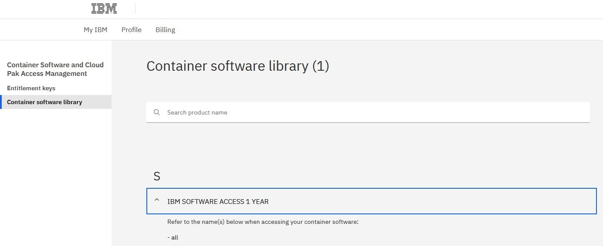
   
   **Business Partners** that do not see **all** here, before proceeding, **must verify that CP4BA is listed on the Container software library page**.
   If you don’t see a CP4BA license listed, you **cannot** perform this bring-up Lab.
   
### 1.2.2 Reserve the OpenShift Tech Zone Envrioment

1. To get an OpenShift cluster from TechZone, access IBM Technology Zone: **https://techzone.ibm.com/**
   
2. To sign-in, either use your IBM ID or your company credentials if SSO is set up between your company and IBM. For example, if you have an IBM W3 or IBM Partnerworld ID, you should use this ID.
   
   > Dependent on the IBM ID used to sign in, you may or may not be able to reserve an OpenShift cluster. If you can't reserve a cluster with the current IBM ID, check if you have another IBM ID that is enabled for IBM Technology Zone reservations.
   
3. Once signed in, open the lab resource page: **https://techzone.ibm.com/collection/ibm-cloud-pak-for-business-automation-demos-and-labs-bring-up-lab**
   
4. On the left hand side select the **Environments** tab. There you should find environment **CP4BA Bring-Up Lab Environment v1.0**, for that environment click on **Reserve**.
   
   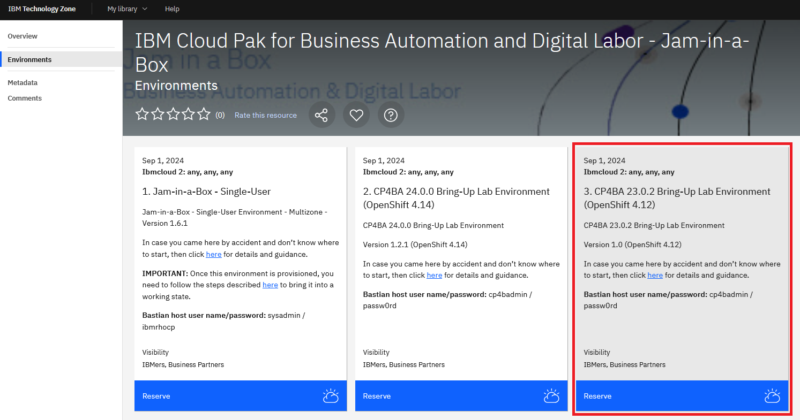
   
   > If you don't see the tile, go back to step 1 and sign in with a different ID.
   
5. Select **Reserve now**.

   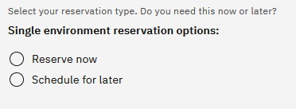
   
6. On the next page, provide the necessary information: Provide the **Purpose**, e.g., "Practice / Self-Education", a description, select the **geography** closest to your location and select the end time and date for the reservation. Plan for at least 6 hours, maybe more. Then click **Submit**.
   
   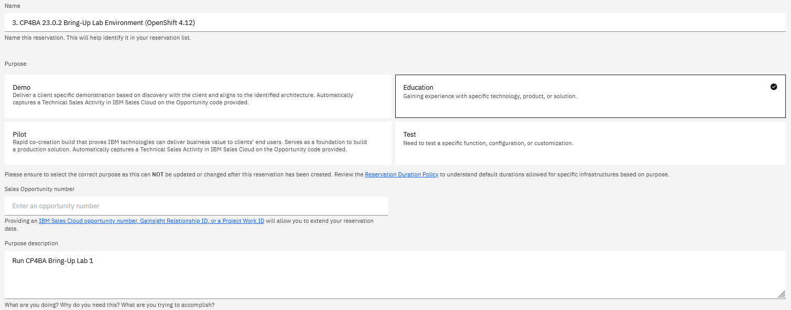
   
   
   
   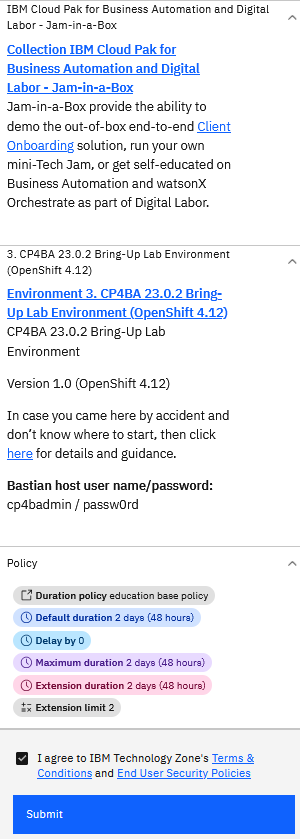
   
7. After you click Submit, you'll get some emails from IBM Technology Zone. Provisioning the environment will take about one hour, then you should get a second email informing you that your environment is **Ready**.
   
   
   
   In case there was an issue provisioning the environment, delete the reservation and try again later.
   
   Once you get the email informing you that your environment is Ready, you can start your Lab.

### 1.2.3 Access the OpenShift Tech Zone Envrioment

1. On your local machine, open the  **[TechZone My reservations](https://techzone.ibm.com/my/reservations)** page. In the browser window, select the reservation for the Bring Up lab.
   
2. Scroll down to the **VM Remote Console** section at the bottom. Click on the bastion VM. This will open the desktop of the bastion host in the Browser.
   
   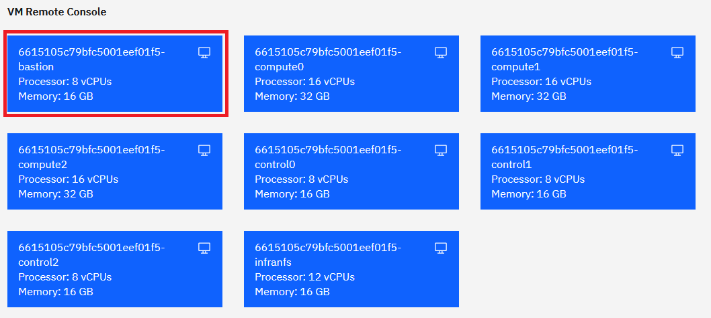
   
3. If you see the current time and date, **press the Space key**. Log-in to the desktop of the bastion host using **cp4badmin / passw0rd** (where the third-last character is a zero).
   
   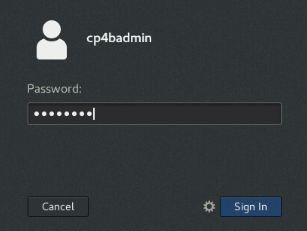
   
   **Note:** If the screen is blank, **move the mouse**.
   
   Now that you have your demo and lab environment available learn how to work with your environment before you start with the Lab.
   
4. Once you logged in, you see the **Red Hat Enterprise Linux (RHEL) Server desktop** of your bastion host.
   
5. Next, ensure the **VM is connected** to the network before proceeding. Check that the network icon in the top right corner shows connected. The environment is not usable if the VM is not correctly connected to the network.
   
   Connected:  (if not connected that icon will not be shown)
   
6. Change the size and resolution of the desktop to your liking. Open **Applications → System Tools → Settings**. The **Displays** page already opens. Change the **Resolution** to your liking.
   
   
   
   In addition, you can switch to Full screen mode. Before you do that, **open these lab instructions in Firefox browser (shortcut on the desktop) of the bastion host**. Within the bastion host, open Firefox, and click the **Tech Jam Labs** bookmark. This brings you to an older github, but the link to the moved one is available on that page. Click **here**. That now brings you to the **ba-dl-tech-jam** github, from there open the **Labs.md** page and navigate to these lab instructions from within the bastion host. Once you have the lab instructions open there, you can switch to Full screen mode:
   
   
   
8. To access your OpenShift cluster through a Browser, **open another tab in Firefox**. Open bookmark **OpenShift Web Console**
   
   Note: In case you get the Warning: Potential Security Risk Ahead, click **Advanced…** and then click **Accept the Risk and Continue**. This is needed two times to finally get to the OCP log-in screen.
   
9. Log in with **ocpadmin / passw0rd** (where the third-last character is a zero).
   
10. Once logged in, verify that the OpenShift Web Console opens and that you have Administrator access.
   
   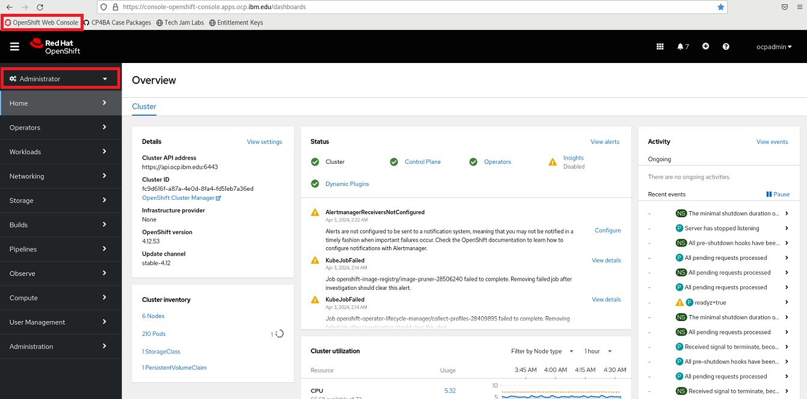
   
11. Next, in the OCP Web Console on the left hand side, expand **Compute** and select **MachineConfigPools**. For **both entries**, resume the updates.
    
    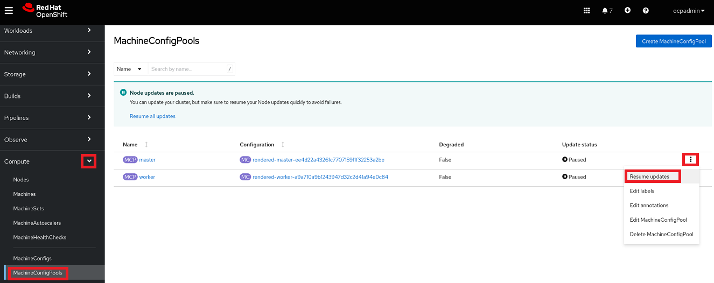
    
12. On the left hand side, go back to **Home -> Overview**. Check that the Status of Cluster, Control Plane and Operators is green, that should happen automatically after a while.
    
    
    
13. Still on the Overview page, the main page, scroll down and verify that the Cluster inventory shows no errors.
    
    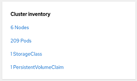
    
    **Note:** The number of pods shown here could be different to what you will see. For Pods, you might see pods in error and / or in progressing state.
    
    The progressing pods should disappear automatically after a while.
    
14. To get rid of the pods in error **click on the red icon** behind Pods. You’ll now see a list of pods that are in error.
    
    For each pod in error, click the three dots at the end of the row and delete that pod.
    
15. In case of **errors, warnings, or pending indicators** that you can't resolve, reach out to your hosting staff to get help.
    
16. To log in through the oc command line interface, expand ocpadmin in the top right corner and select Copy login command.
    
    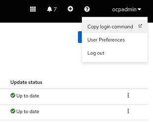
    
17. A new tab opens. Log in again with **ocpadmin / passw0rd** (where the third-last character is a zero) and click **Display Token**.

18. Copy the entire oc login command to the clipboard.

    
    
19. Open a Terminal window, paste the clipboard's content, and hit Enter.

    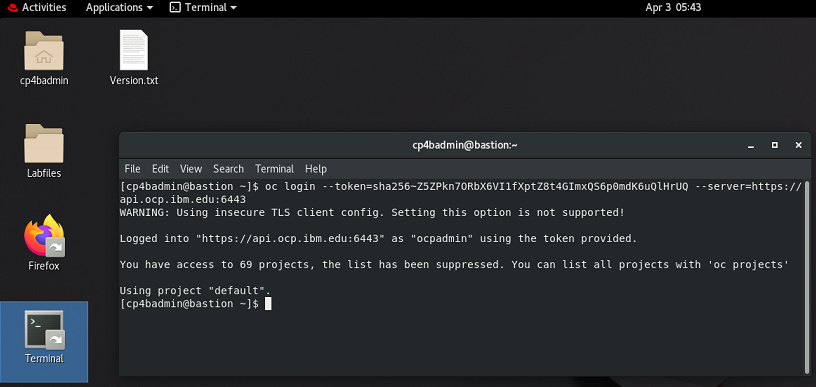
    
20. Next, **run** this command:
    
    ```sh
    oc version
    ```
    
    Expected output, make sure to see the `Server Version:` line:
    
    

You have now successfully accessed and updated your environment and are ready to start with the lab.

To continue, refer to **[Exercise 2: Deploy DB2](Exercise-2-Deploy-DB2.md)**.
